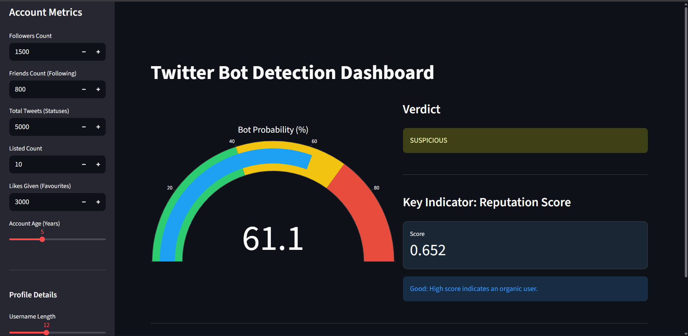

# Twitter Bot Detection Pipeline
### End-to-End Machine Learning & Behavioral Analytics

This project implements a robust machine learning pipeline to distinguish between human users and automated bots on Twitter using the **TwiBot-20** research dataset.

## 🚀 Key Features
- **Big Data Handling**: Processed 6GB+ of nested JSON raw data into a structured feature matrix.
- **27 Behavioral Features**: Engineered complex metrics including `account_age`, `reputation_score`, `engagement_ratio`, and behavioral heuristics.
- **Bias Mitigation**: Removed biased features (Verified Status) to ensure the model captures genuine bot behavior rather than platform shortcuts.
- **Production Dashboard**: A live Streamlit application for real-time account auditing with visual confidence gauges.

## 🖥️ Dashboard Preview

*Interactive UI for real-time bot probability analysis and behavioral metrics.*

## 📊 Model Performance
The pipeline evaluates 6 classic models. **Gradient Boosting** was selected for production:
- **F1-Score**: 80.4%
- **Bot Recall**: ~90% (Optimized to minimize false negatives)
- **Primary Indicators**: Reputation Score, Followers/Friends Ratio, Account Age.

## 📁 Project Structure
- `feature_extraction.py`: ETL factory for parsing raw TwiBot-20 JSON data.
- `train_model.py`: Production trainer that scales data and serializes the `.pkl` artifacts.
- `dashboard.py`: Front-end Streamlit application for inference.
- `predict.py`: CLI-based inference script.
- `Twitter_Bot_Detection.ipynb`: Research notebook containing EDA and model tournament logic.

## 🛠️ Installation & Usage
1. Clone the repository.
2. Install dependencies:
   ```bash
   pip install -r requirements.txt
   ```
3. Run the Dashboard:
   ```bash
   streamlit run dashboard.py
   ```

## ⚖️ License
This project is licensed under the MIT License.

